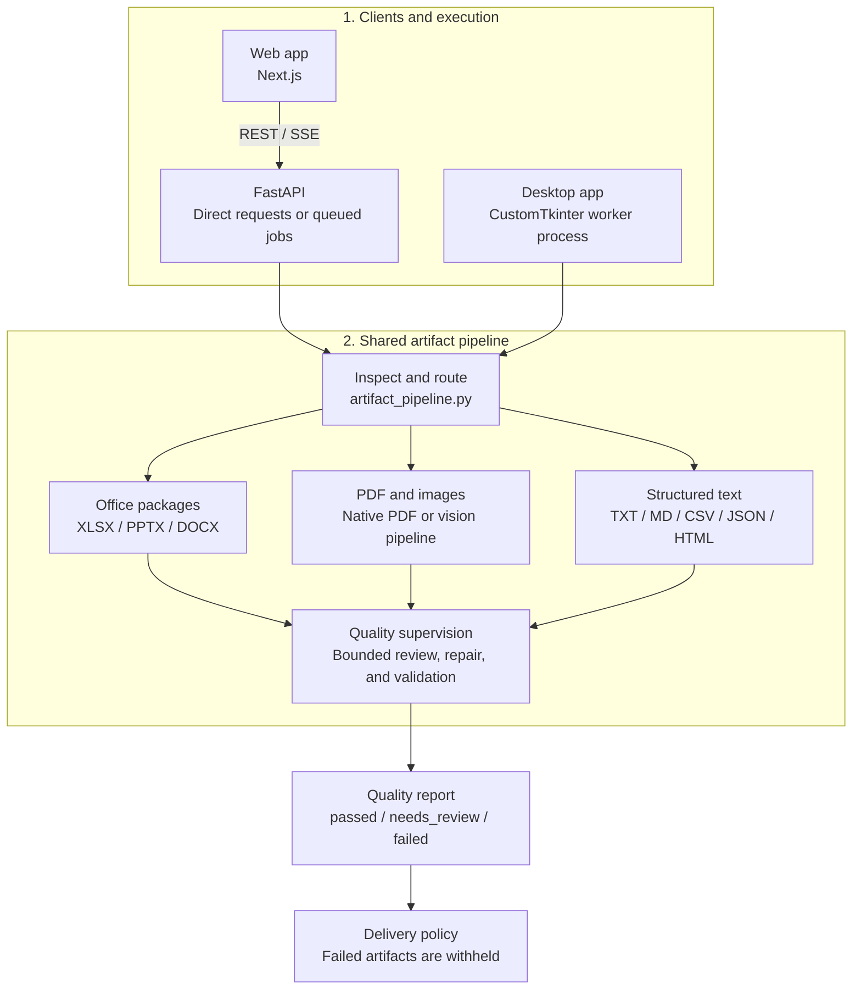
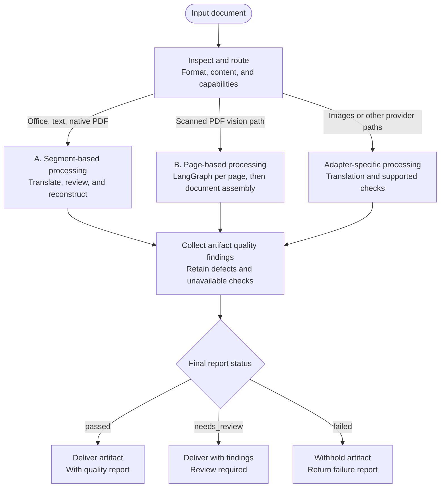
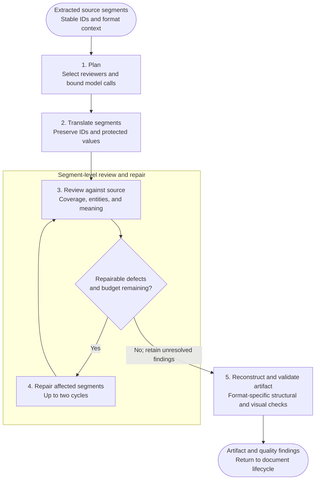
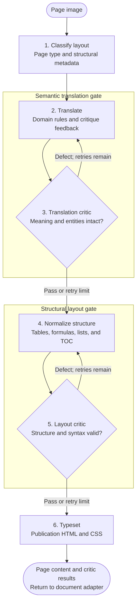
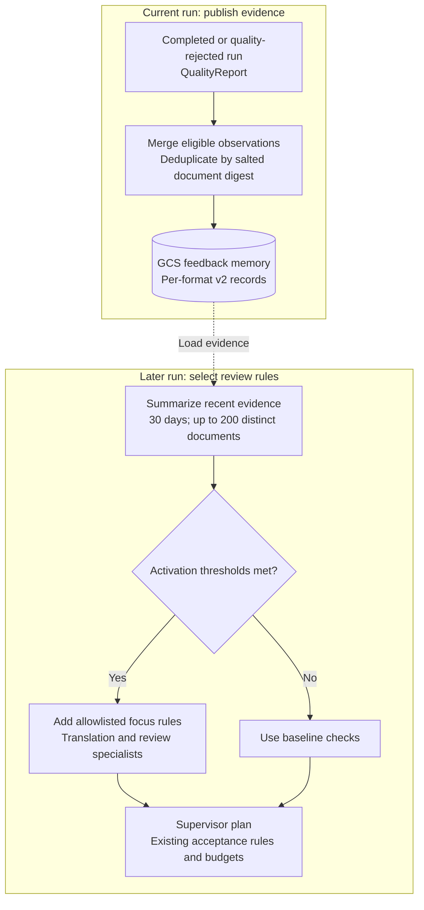
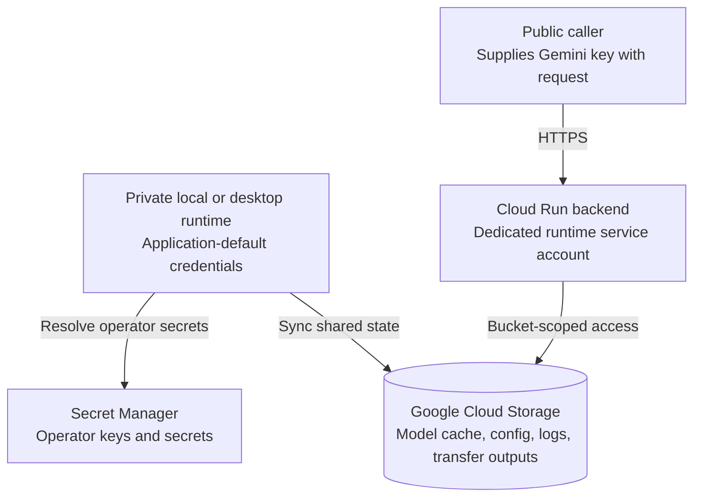
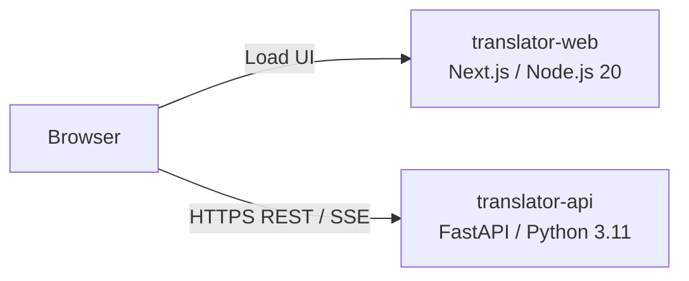

# Document Translator

A modern, automated platform to translate documents—including PowerPoint presentations (`.pptx`, `.ppt`), Excel workbooks (`.xlsx`, `.xls`), Word documents (`.docx`), PDF files (digital & scanned), images, and plain text (`.txt`, `.md`, `.csv`, `.json`, `.html`)—while preserving original layouts, typography, formatting, and structural metadata.

<div align="center">
  <h3>Powered by Gemini AI Multimodal Models and Google Translate</h3>
</div>

---

## ✨ Key Features

- **Multimodal Document Translation**: Seamlessly translates **PDF (digital & scanned OCR), Word, Excel, PowerPoint, Text, Image, Markdown, CSV, JSON, and HTML** files while preserving tables, clauses, and visual hierarchy.
- **Quality-Gated Artifact Pipeline**: Every file passes through a new `backend/quality/` pipeline that inspects, plans, translates, reviews, and structurally validates the artifact before delivery — files that fail hard invariants are withheld rather than silently delivered.
- **Staged Multi-Agent Orchestration (LangGraph)**: Employs an autonomous state machine featuring specialized vision, translation, and structural agents governed by **two independent micro-gates**:
  - **Semantic Translation Critic Gate**: Audits omissions, entity preservation, and register fidelity immediately after translation.
  - **Structural Layout Linter Gate**: Programmatically validates subordinate condition tiers, table column consistency, formula syntax, and HTML renderability before typesetting.
- **Localized Targeted Repair**: Formatting defects are resolved locally at the structure layer without re-translating, avoiding unnecessary vision API calls and preventing translation regressions.
- **Durable Job Queue**: A persistent SQLite-backed job system (`backend/jobs.py`) with worker leases, idempotent submission, cancellation, checkpoints, and per-provider concurrency limits enables reliable multi-file batch processing that survives backend restarts.
- **Native Office Package Patching (`ooxml_text.py`)**: Translates XLSX, PPTX, and DOCX by patching the raw XML packages — retaining hyperlinks, run styling, charts, formulas, shapes, comments, and shared-string relationships rather than rebuilding from scratch.
- **Gemini Model Selection**: Select from the configured model options or refresh the list using your own API key; availability depends on your provider account.
- **Whole-Document Continuity Review**: A sliding-window review engine audits cross-page sentence splits, multi-page table continuity, and consecutive article numbering.
- **Detailed Excel & PPTX Support**: Automatically translates **sheet names**, **cell comments (memos)**, table cells, and complex slide shapes.
- **Ephemeral Cloud Storage & Direct Signed Downloads**: Seamlessly supports cloud transfer outputs by saving artifacts to short-lived Google Cloud Storage buffers and providing direct signed URLs, bypassing Cloud Run's 32 MiB response limit.
- **Output Retention**: Durable job artifacts expire according to the job TTL. Configure a bucket lifecycle rule for legacy cloud transfer outputs; downloading a file does not delete it.
- **Browser Activity Log**: View translation progress and download the activity recorded in the current browser session.
- **Two Flexible Interfaces**:
  - **Desktop App**: Standalone CustomTkinter desktop application with live process isolation and executable packaging.
  - **Web Application**: Serverless Next.js 15 web application with live terminal-style Server-Sent Events (SSE) streaming deployed on Google Cloud Run.
- **Multi-Tier Model Cache**: In-memory, Google Cloud Storage, and local disk synchronization for zero-latency model availability.

---

## 🌐 Web Version

Run the web application locally using the instructions below, or deploy your own instance using [the deployment guide](#️-cloud-deployment). Publishing this source does not certify an existing hosted instance for public document uploads.

The hosted translator uses a **bring-your-own-key** model. Enter your own Gemini API key to use Gemini; the public Cloud Run API never uses the maintainer's Gemini secret for visitor requests. Google Translate can be selected without a Gemini key. Keys stay in the current browser tab by default; persistent browser storage is an explicit opt-in. Review [Privacy and Data Handling](#-privacy--data-handling) before uploading documents.

## 🔐 Security and Public Use

- Public deployments require a caller-supplied Gemini key and do not expose server logs or Cloud Console links through the API.
- Request bodies are size-limited, the backend deploy script caps the service at one instance and eight concurrent requests, and a per-instance request limiter is enabled. For distributed, internet-facing abuse protection, deploy behind an external load balancer with Cloud Armor and block direct access to the default Cloud Run URL; see [the deployment guide](#public-service-configuration--hardening).
- Create the dedicated bucket-scoped runtime identity before deploying: `./deploy/setup-runtime-identity.ps1 -ProjectId <project>` on Windows or `./deploy/setup-runtime-identity.sh <project>` on Linux/macOS. The deployment identity also needs `roles/iam.serviceAccountUser` on `translator-runtime`.
- See [Security policy](.github/SECURITY.md), [Contributing](.github/CONTRIBUTING.md), and [Privacy and Data Handling](#-privacy--data-handling).
- This repository has no `LICENSE` yet. Repository visibility alone does not grant permission to reuse the code; choose and add the intended license before inviting reuse or contributions.

## 🔒 Privacy & Data Handling

This section documents data handling, lifecycle retention, and storage boundaries for the platform. Separately hosted deployments may configure different storage, logging, retention, and provider settings; operators are responsible for publishing terms suited to their specific environment.

### What You Send
- **Browser-to-Backend Transmission**: The browser sends input text or uploaded files, target language, selected model, and (for Gemini) your API key directly to the configured translator backend over HTTPS.
- **Provider Policies**: Gemini requests are processed using the caller's supplied API key. Google Translate requests use the configured provider. All provider-side processing is governed by the respective provider's terms of service and privacy policy.
- **Credential Storage**: Gemini API keys are held exclusively in browser **session storage** by default and are sent solely with translation and model requests. Users may explicitly opt in to persistent local storage ("Remember this key in this browser"). Keys should be cleared when finished, and persistent storage must never be used on shared devices.
- **Backend Credential Isolation**: The backend holds visitor Gemini keys in worker process memory only for the duration of the request or active job lease. Keys are **never** persisted to the SQLite job database, audit logs, or shared cloud storage. Cloud Run deployments never use maintainer secrets for visitor requests.

### Temporary Files & Operational Data Retention
- **Local Job Processing**: Durable batch jobs store source documents, intermediate representations, generated translation artifacts, and quality reports under the designated job directory (`$TRANSLATOR_JOB_DIR`, defaulting to the system temporary directory). Files are automatically purged when their time-to-live expires (`TRANSLATOR_JOB_TTL`, default 24 hours). Ephemeral serverless container filesystems (such as default Cloud Run) may lose local job state earlier upon instance restarts.
- **Transfer Buffers & Cloud Storage**: Synchronous download artifacts can be written to the local temporary output directory and buffered in Google Cloud Storage under `document-translator/outputs/` to generate direct signed URLs for large files (> 32 MiB). Operators must configure bucket lifecycle deletion rules to ensure automatic removal of transfer buffers.
- **Audit & Operational Logging**: Operational audit events are logged to `gs://<bucket>/document-translator/run_log.json` and Cloud Logging. Records include job status, AI provider, language, execution duration, output file size, and success/failure metadata (retaining up to 1,000 recent records). Application diagnostics and stack traces may contain exception details, access to which is restricted to the operator's Google Cloud project IAM.
- **Access Tokens**: Batch status endpoints, inspection quality reports, and download links are protected by randomly generated per-batch access tokens.
- **Confidential Records**: The hosted web demo does not provide authenticated user accounts or guarantee enterprise-grade retention or regulatory compliance (e.g., HIPAA, GDPR data residency). Do not upload confidential or regulated documents until verifying the deployment's storage retention and provider policies.

### Browser-Side Storage
- **Application Preferences**: The frontend caches model preferences, target languages, and UI settings in browser `localStorage`.
- **API Key Scoping**: Gemini API keys remain in `sessionStorage` (cleared upon closing the tab/browser) unless "Remember this key in this browser" is explicitly enabled. Browser storage is unencrypted and accessible to scripts executing within the browser origin.

### Optional Aggregate Quality Feedback
- When `TRANSLATION_FEEDBACK_BUCKET` is configured by the operator, cross-worker failure memory stores pseudonymous records containing only timestamps, allowlisted failure codes, and salted SHA-256 document digests.
- Records strictly **exclude** document text, finding details, file names, user identities, and API credentials.
- See [Adaptive Quality Checks & Feedback Loop](#-adaptive-quality-checks--feedback-loop-backendqualityfeedbackpy) for complete technical specifications.

---

## 🏛️ System Architecture

### High-Level System Architecture

The overview shows component relationships from clients to delivery. The document lifecycle below contains the segment and page processing paths; their detailed diagrams expand each path. The feedback diagram explains adaptation across runs; cloud dependencies are shown in **Multi-PC Cloud Architecture**.



Batch requests use the SQLite job store in [`jobs.py`](backend/jobs.py), with worker leases, checkpoints, and per-provider concurrency limits. Direct API requests and desktop workers enter the same router. Quality controls run within each adapter; the shared quality node summarizes those controls rather than a separate service.

| Component | Responsibility | Implementation |
|---|---|---|
| Shared pipeline | Inspect documents and select the format adapter | [`artifact_pipeline.py`](backend/engines/artifact_pipeline.py) |
| Office adapter | Patch XLSX, PPTX, and DOCX text while preserving package structure | [`ooxml_text.py`](backend/handlers/ooxml_text.py) |
| PDF and image adapters | Native PDF translation, scanned-page processing, and image translation; LangGraph stages for page processing | [`handlers/`](backend/handlers/), [`agents/graph.py`](backend/agents/graph.py) |
| Structured text adapter | Translate TXT, Markdown, CSV, JSON, and HTML | [`text_adapter.py`](backend/quality/text_adapter.py) |
| Quality controls | Inspection, bounded supervision, review, and validation | [`quality/`](backend/quality/) |

**Supporting services** are shared across the workflow:

- **Google Cloud Storage:** model cache, transfer buffers, and audit logs.
- **Optional feedback memory:** recurring failure insights used by the supervisor ([`feedback.py`](backend/quality/feedback.py)).
- **Credentials:** caller-supplied Gemini keys for public requests; Secret Manager for private operator workflows.

### Document Artifact Lifecycle

Every file enters the shared router, which selects a format-specific processing path. **A and B are alternative processing paths within this lifecycle**, with their own review and repair scopes. The lifecycle collects their findings and applies the delivery policy; it does not run a second copy of every translation critic.



| Scope | Review and repair responsibility | Result |
|---|---|---|
| Segment processing (A) | Source-grounded meaning, coverage, and protected values; repair affected segment IDs | Translated segments and findings for artifact reconstruction |
| Page processing (B) | Page meaning and layout syntax; retry translation or structural normalization locally | Page content and critic results for document assembly |
| Artifact lifecycle | Combine adapter findings, preserve failed or unavailable checks, and determine delivery status | Document quality report and delivery decision |

**Retry exhaustion is not acceptance.** Page or segment defects remain in the report. Missing or failed pages produce `failed`; unsupported checks produce `needs_review` with explicit findings. Hard failures may stop a path before its final stage.

The supervisor loads optional feedback insights during planning. Completed or quality-rejected runs publish eligible observations for later runs, described in **Adaptive Quality Checks & Feedback Loop**. See the [quality architecture guide](tools/evaluation/translation-quality-assessment.md) for implementation details.

#### A. Segment Translation and Artifact Validation

This expands **path A**: Office packages, structured text, and native digital PDFs expose source segments with stable IDs. The supervisor translates and reviews those segments; the format adapter reconstructs the output and applies its supported artifact checks. The document lifecycle then uses the resulting report to determine delivery.



Checks depend on the adapter: Office validates package preservation, native PDF checks text placement and rendering, and structured text validates its format. Hard failures can stop reconstruction or delivery. Missing review evidence remains visible in the quality report.

#### B. LangGraph Page Processing

This expands **path B** in the document lifecycle: the scanned-PDF handler invokes **LangGraph** for individual rendered pages. It returns page content and critic results to the document adapter for assembly and artifact checks. Office, structured-text, and native-PDF segment translation do not pass through this graph.

The graph has two independent retry loops. Each gate allows two retries by default. Reaching the limit advances processing but retains a `needs_review` status when a critic still fails; it does not imply acceptance.



##### Specialized Agent Node Roles

1. **👁️ Page Classifier Agent (`classifier_node`)**: Inspects the rendered page image using multimodal vision to classify the structural domain (`toc`, `table_dense`, `structured_clauses`, `standard`) and extracts granular layout metadata (`is_wide_matrix`, `has_multi_tier_headers`, `has_formulas`, `has_two_column_lists`, `has_nested_lists`).
2. **✍️ Translation Specialist Agent (`translator_node`)**: Translates content with domain-specific terminology, injecting specialized layout preservation rules. If iterating after critique, it incorporates targeted semantic feedback into its revision prompt.
3. **🛡️ Micro-Gate 1: Translation Semantic Critic (`translation_critic_node`)**: Evaluates semantic completeness immediately after translation. Audits omissions, untranslated source characters, entity numbers, and flags truncation placeholders (`[continues]`, `[omitted]`).
4. **📐 Table & Structure Specialist Agent (`table_specialist_node`)**: Normalizes structural elements: splits concatenated TOC lines onto discrete rows, formats page footers, balances pipe table column counts, converts LaTeX formulas to HTML tables, and executes targeted line unflattening for squashed tiers.
5. **🛡️ Micro-Gate 2: Structural & Layout Linter Critic (`formatting_critic_node`)**: Fast deterministic linting (regex, TOC discipline, LaTeX math, pipe column counts, subordinate condition tiers) plus dry-run `LayoutEngine` HTML parse validation before typesetting.
6. **🎨 Typesetter Agent (`typesetter_node`)**: Leverages `backend/engines/layout_engine.py` to produce print-ready HTML/CSS, executing dynamic 2-column dot leaders and composite table splitting for wide matrices.

---

### 📈 Adaptive Quality Checks & Feedback Loop (`backend/quality/feedback.py`)

The existing planner, translator, independent reviewers, and bounded repair loop can adaptively use recent failure evidence to focus future reviews. This is **rule selection, not model training or autonomous code modification**. Its effect on translation quality must be evaluated; activation alone is not proof of improvement.



Activation requires **at least 3 eligible documents, 2 failing documents, a 20% failure rate, and 1 distinct failure day** for a known failure class. Disabled or unavailable feedback falls back to baseline checks. The dashed arrow represents stored evidence read by a later run.

#### Core Operational Policies

1. **Configuration**:
   - Set `TRANSLATION_FEEDBACK_BUCKET` to an operator-controlled Google Cloud Storage bucket to enable shared cross-worker failure evidence.
   - The runtime identity requires GCS object read/create/update access (`storage.objects.get`, `storage.objects.create`, `storage.objects.update`).
   - Unset `TRANSLATION_FEEDBACK_BUCKET` to disable evidence reads and writes immediately. Evidence aggregation uses zero model calls; activated review specialists operate within existing call and repair budgets.

2. **Observation Window & Activation Thresholds (v2)**:
   - For each document format (`pdf`, `docx`, `pptx`, `xlsx`, `txt`, `md`, `csv`, `json`, `html`, `png`, `jpg`), version 2 retains the latest **200 distinct inspected documents** within a rolling **30-day window**.
   - Each known failure class activates only after:
     - At least **3 eligible documents** (`MIN_DOCUMENTS = 3`),
     - At least **2 failing documents** (`MIN_FAILURES = 2`),
     - A failure rate of at least **20%** (`MIN_RATE = 0.20`), and
     - At least **1 distinct failure day** (`MIN_DAYS = 1`).
   - Observations may originate from the same day and user; there is no multi-day or multi-tenant requirement. These low-volume defaults allow a small batch to activate a predefined check, while preventing any single document from triggering activation.
   - Clean inspections count toward the denominator; unavailable inspections do not. Successfully repaired problems still count as failure observations. Cancelled or interrupted processing is never published.
   - **Document Deduplication**: The same source document counts exactly once within the rolling window, regardless of retries, target languages, or selected models.

3. **Strict Instruction Allowlist & Prompt Safety**:
   - Only pre-defined, allowlisted review codes can be activated:
     - `numbers`: Numeric equivalence and protected identifier validation (`protected_entities`).
     - `coverage`: Component omission and duplicate translation audit (`coverage`).
     - `text_fit`: Text container bounding and clipping detection (`native_text_rendering`).
     - `overflow`: Glyph bounds, table cells, and shape text overflow inspection (`visual`).
     - `visual`: Table cell associations, merged headers, empty cell and artwork preservation (`visual`).
     - `immutable_structure`: Preservation of native object hierarchy and protected references (`immutable_structure`).
   - **No document-derived text ever becomes an instruction.** Instructions only guide translation prompts and select existing reviewer specialists. Mandatory checks, acceptance criteria, and call budgets remain strictly enforced.
   - Introducing new defect classes or repair strategies requires an implementation code change and regression evaluation.

4. **Quality Reports & Insights**:
   - Quality reports include `feedback_insights`: eligible document counts, failure counts, days, rates, and active flags used for that run.
   - These are deployment-wide aggregates by format, not tenant-specific or language-specific conclusions.
   - Compare subsequent reports and a fixed evaluation corpus before claiming quality gains. There is no causal experiment or automatic promotion of newly generated rules.

5. **State Storage & Concurrency Control**:
   - State is stored at `translation-feedback/v2/<format>.json` within the configured bucket.
   - Writes use Cloud Storage generation preconditions (`if_generation_match`) with up to 3 write attempts to avoid lost updates between concurrent workers.
   - Outages or invalid state fall back gracefully to built-in checks.
   - Version 1 single-failure flags are ignored. To reset evidence, delete the v2 objects in the bucket (workers should be paused during a reset).

6. **Privacy & Pseudonymity**:
   - Feedback records contain only timestamps, allowlisted check codes, and a salted SHA-256 source digest identifier (`hashlib.sha256(salt + source_bytes).hexdigest()`).
   - Feedback records contain **NO document text, finding messages, filenames, user identifiers, languages, or API keys**.
   - Salted identifiers serve as pseudonymous metadata for deduplication, not a guarantee of anonymity. Expired records (> 30 days) are ignored on reads and pruned during the next write.
   - Configure bucket lifecycle rules and version retention to physically remove inactive or historical state; logical expiration alone does not delete stored objects.
   - Restrict bucket access; use separate buckets for deployments that must not share evidence.

7. **Offline Regression Testing**:
   - Run the dedicated regression suite to verify evidence accumulation, concurrency handling, privacy invariants, and activation logic:
     ```bash
     python -m unittest tools.evaluation.feedback_regressions
     ```

---

### 🗄️ Durable Job System (`backend/jobs.py`, `backend/job_api.py`)

Durability requires persistent local storage. Cloud Run uses an ephemeral container filesystem, so jobs and artifacts can disappear when an instance is replaced, including during deployment. The Dockerfile `VOLUME` declaration does not provision persistent Cloud Run storage. A single-instance cap does not change this limitation. See the [Cloud Run filesystem contract](https://docs.cloud.google.com/run/docs/container-contract#filesystem).

The web frontend supports **multi-file batch uploads** that persist across browser reloads and backend restarts:

- **Idempotent Submission**: Repeated uploads of the same file (same SHA-256 fingerprint + options) return the existing job rather than creating a duplicate.
- **Worker Leases**: SQLite row-level leases prevent two workers from processing the same job concurrently, even on restart.
- **Checkpointing**: Completed segments are persisted mid-translation; a restarted job resumes from the last checkpoint.
- **Cancellation**: Jobs can be cancelled at any point; cancelled jobs cannot publish artifacts.
- **Per-Provider Limits**: Separate concurrency limits per AI provider prevent one model from monopolizing workers.
- **Expiry**: Artifacts and job records expire after a configurable TTL (default 24h); expired records deny all access and purge data.
- **Credential Isolation**: User-supplied API keys are held only in worker memory and are never persisted to the database. After a restart, affected jobs request credentials again and retain their checkpoints.

---

### 📑 Whole-Document Sliding-Window Review Engine

In addition to page-level micro-gates, full documents undergo cross-page review via `DocumentReviewEngine` (`backend/engines/review_engine.py`):
- **Cross-Page Sentence Boundary Continuity**: Detects and joins split sentences spanning across page margins.
- **Multi-Page Table Header Continuity**: Restores repeated headers and consistent column counts when dense tables split across pages.
- **Sequential Article Numbering**: Identifies duplicate or missing article/section numbers.
- **Sliding Window Multi-Page Context**: Processes overlapping windows of 3–5 pages with up to 2 full audit iterations.

---

## 📁 Repository Structure

```
multi-language-document-translator/
├── .github/               # Security policy and contribution guidance
├── backend/
│   ├── agents/            # LangGraph multi-agent pipeline (classifier, translator, critics, typesetter)
│   │   ├── graph.py       # LangGraph state machine definition
│   │   ├── nodes.py       # Agent node implementations
│   │   └── state.py       # Shared pipeline state dataclass
│   ├── core/              # Cloud secrets resolution, GCS persistence, logging, telemetry
│   ├── desktop/           # CustomTkinter GUI application, packaging spec, process wrapper
│   ├── engines/           # Document pipeline, review engine, layout engine, translation core
│   │   ├── artifact_pipeline.py  # Shared pipeline router (web jobs + desktop)
│   │   ├── document_pipeline.py  # Document pre-assessment & handler dispatch
│   │   ├── layout_engine.py      # HTML/CSS typesetting engine
│   │   ├── review_engine.py      # Sliding-window cross-page audit engine
│   │   ├── translator.py         # Core Gemini & Google Translate adapters
│   │   └── visual_inspector.py   # Page image visual inspection helper
│   ├── handlers/          # Format handlers
│   │   ├── ooxml_text.py  # Native Office XML package patcher (XLSX, PPTX, DOCX)
│   │   ├── pdf_native.py  # Native digital PDF translation
│   │   ├── pdf_scanned.py # Scanned PDF OCR handler
│   │   ├── pdf_digital.py # Digital PDF rendering handler
│   │   ├── image_handler.py
│   │   └── text_handler.py
│   ├── quality/           # Quality-gated artifact pipeline
│   │   ├── inspection.py  # Binary signature, format capability & segment extraction
│   │   ├── feedback.py    # Shared failure memory & adaptive review rule activation
│   │   ├── models.py      # Shared contracts: Segment, Finding, Manifest, Plan, QualityReport
│   │   ├── supervisor.py  # Bounded planner, translation specialists, repair & review loop
│   │   ├── validation.py  # Structural XML comparison and LibreOffice visual validation
│   │   ├── text_adapter.py  # Structured text format adapters (MD, CSV, JSON, HTML)
│   │   └── entities.py    # Numeric token extraction and equivalence rules
│   ├── rules/             # Prompt templates and format preservation rules
│   ├── storage/           # Model cache management and cloud synchronization
│   ├── api.py             # FastAPI REST & SSE streaming server
│   ├── job_api.py         # Durable job REST router (/jobs prefix)
│   ├── jobs.py            # SQLite-backed durable job store, leases, checkpoints
│   ├── Dockerfile         # Production container definition for Google Cloud Run
│   └── main.py            # Desktop application launch entrypoint
├── deploy/                # Cloud Run & Cloud Build deployment automation scripts
│   ├── cloudbuild.yaml             # Combined Cloud Build pipeline
│   ├── cloudbuild-backend.yaml     # Backend-only Cloud Build pipeline
│   ├── cloudbuild-frontend.yaml    # Frontend-only Cloud Build pipeline
│   ├── deploy-all.ps1 / .sh        # Full-stack deployment scripts
│   ├── deploy-backend.ps1 / .sh    # Backend-only deployment scripts
│   ├── deploy-frontend.ps1 / .sh   # Frontend-only deployment scripts
│   └── setup-runtime-identity.ps1 / .sh # Dedicated bucket-scoped IAM runtime provisioning
├── frontend/              # Next.js 15 web application (React 19)
│   ├── app/               # Next.js application routes and UI components
│   │   └── durable-jobs.ts  # Durable job client (submission, polling, download)
│   ├── Dockerfile         # Frontend container definition
│   └── package.json       # Frontend dependencies and build scripts
├── output/                # Local offline evaluation results (ignored)
│   └── evaluation.json    # Machine-readable corpus run results
├── tools/                 # Developer, evaluation, verification, and operations utilities
│   ├── evaluation/        # Offline regression corpus and quality checks
│   │   ├── corpus.v1.json              # Versioned test fixture corpus
│   │   ├── run_evaluation.py           # Corpus runner (requires local test modules)
│   │   ├── test_*.py                   # Local-only regression suites (ignored)
│   │   └── translation-quality-assessment.md  # Quality architecture & status
│   ├── operations/        # Batch translation, sample review, and secret sync commands
│   │   ├── run-local.ps1               # Windows setup, checks, and service launcher
│   │   ├── sync_secrets.py             # Cloud secret & bucket health check utility
│   │   ├── translate_documents.py      # Batch translation CLI
│   │   └── translation-pipeline.md     # Operations guide: config, API, recovery, quality reports
│   └── verification/      # API, streaming, and durable-job integration checks
│       ├── verify_api_stream.py          # Backend SSE stream smoke test
│       ├── verify_document_stream.cjs    # Browser document stream smoke test
│       └── verify_durable_jobs_ui.cjs    # Browser durable-jobs UI smoke test
├── .gitignore             # Comprehensive hygiene rules preventing credential and cache leaks
└── requirements.txt       # Python runtime dependencies
```

---

## ☁️ Multi-PC Cloud Architecture

Local operators can authenticate using Google Cloud application-default credentials. Cloud Run uses its dedicated runtime service account for storage access. Public Gemini requests require a caller-supplied key; cloud authentication alone does not provide visitor credentials.




### Architectural Storage & Resolution Strategy

| Layer | Target Cloud Service | Location / Format | Multi-PC Resolution Strategy |
| :--- | :--- | :--- | :--- |
| **Operator API Keys & Secrets** | **Google Cloud Secret Manager** | `gemini-api-key`, `langsmith-api-key` | Used only by private local/desktop workflows; public Cloud Run requests must supply the visitor's key |
| **Persistent State / Models** | **Google Cloud Storage (GCS)** | `gs://<project>-document-translator-data/` (`asia-northeast1`) | Canonical source of truth; regional bucket in Tokyo; local caches strictly reside in OS temporary directory (`tempfile.gettempdir()`) |
| **User Preferences** | **Google Cloud Storage (GCS)** | `gs://<bucket>/document-translator/config.json` | Synced to GCS and OS temp cache; never written to git workspace |
| **Operational & Audit Logs** | **GCS & Cloud Logging** | `gs://<bucket>/document-translator/run_log.json` + `stdout` | Operational status metadata; not exposed through public API routes |
| **Ephemeral Transfer Outputs** | **Google Cloud Storage (GCS)** | `gs://<bucket>/document-translator/outputs/` | Short-lived transfer buffers with signed download URLs; configure and verify bucket lifecycle deletion |
| **Durable Job Artifacts** | **Local Persistent Volume** | `$TRANSLATOR_JOB_DIR/` (default: OS temp) | SQLite job store + artifact files on one host; horizontal Cloud Run scaling requires an external distributed store |
| **Preserved Evaluation Samples** | **Local Storage** | `samples/` (optional, local-only) | Sample test documents preserved locally in `samples/sample_input/` and `samples/sample_output/` (ignored in git) |

---

## ⚙️ Environment Variables & Configuration

When authenticated with Google Cloud, shared cloud state resolves automatically. The variables below are optional runtime overrides; operator credentials belong in Secret Manager and must not be used as visitor credentials by the public API:

| Variable | Default | Description |
|---|---|---|
| `GOOGLE_CLOUD_PROJECT` | Auto-detected | Target GCP project identifier (defaults to active `gcloud` configuration). |
| `GCS_BUCKET_NAME` | `<project>-document-translator-data` | Target Google Cloud Storage bucket for shared models, config, and audit logs. |
| `GEMINI_API_KEY` | Unset | Used by private local/desktop runs. Public Cloud Run requests always require the visitor's own key. |
| `ALLOW_SERVER_GEMINI_KEY` | `false` | Explicit local-only opt-in to resolve the operator's Gemini key. Ignored on Cloud Run. |
| `LANGSMITH_API_KEY` | *Secret Manager* | Overrides the `langsmith-api-key` resolved from GCP Secret Manager. |
| `OUTPUT_DIR` | OS Temp (`%TEMP%/translator_output`) | Directory for rendered files; defaults to OS temp to prevent workspace pollution. |
| `LOGS_DIR` | OS Temp (`%TEMP%/translator_logs`) | Directory for persistent log files; defaults to OS temp to prevent workspace pollution. |
| `PORT` | `8080` | Port bound by the FastAPI backend web service. |
| `NEXT_PUBLIC_API_URL` | `http://localhost:8080` | Backend API endpoint URL used by Next.js frontend. |
| `TRANSLATOR_JOB_DIR` | OS Temp (`/tmp/translator-jobs`) | Root directory for the SQLite job store and artifact files. Must be a persistent local volume for durable jobs. |
| `TRANSLATOR_JOB_TTL` | `86400` | Job artifact retention in seconds (default 24h). Expired jobs deny access and purge data. |
| `TRANSLATOR_JOB_WORKERS` | `2` | Total concurrent job worker threads. |
| `TRANSLATOR_PROVIDER_WORKERS` | `2` | Maximum concurrent workers per AI provider (prevents one model monopolizing the pool). |
| `TRANSLATION_FEEDBACK_BUCKET` | Unset | Optional operator-controlled GCS bucket for shared failure memory and adaptive review rule activation. Unset to disable. |

---

## 🚀 Getting Started & Zero-Setup Run

Prerequisites: Python 3.11+, Node.js 20+, and npm. Install LibreOffice for Office rendering checks; cloud deployment additionally requires the Google Cloud SDK and access to the target project.

### 1. Cloud Authentication (for operator cloud features)
Authenticate once with Google Cloud SDK:
```bash
gcloud auth login
gcloud auth application-default login
```

Verify that all cloud secrets, models cache, and storage buckets are healthy:
```bash
python tools/operations/sync_secrets.py --check
```

### 2. Installation
```bash
# Clone the repository
git clone https://github.com/henryhyunwookim/multi-language-document-translator.git
cd multi-language-document-translator

# Install Python backend dependencies
pip install -r requirements.txt

# (Optional) Install Next.js frontend dependencies
cd frontend
npm ci
cd ..
```

### 3. Launching the Desktop Application
```bash
# Launch via standard launcher (API key and settings load automatically from cloud):
python backend/main.py
```

### 4. Running the Full Web App Locally (Windows)
The launcher starts the API and web UI together, monitors startup, writes service logs under `%LOCALAPPDATA%\DocumentTranslator\logs`, and cleans up both process trees on Ctrl+C:
```powershell
.\tools\operations\run-local.ps1 -Mode Setup  # First run only: install Python and frontend dependencies
.\tools\operations\run-local.ps1 -Mode Check  # Optional local dependency and renderer checks
.\tools\operations\run-local.ps1             # Start API on 8080 and web UI on 3000
```
Open `http://127.0.0.1:3000`; the API docs are at `http://127.0.0.1:8080/docs`. Use `-ApiPort` and `-WebPort` to choose other ports. Enter a Gemini API key in the UI. To opt into the operator's key for a private local-only run, set `ALLOW_SERVER_GEMINI_KEY=true`; Cloud Run ignores this setting.

The API and UI may also be run separately for development:
```bash
uvicorn backend.api:app --reload --port 8080
cd frontend && npm run dev
```

---

## 🛠️ Multi-PC Sync Utility (`tools/operations/sync_secrets.py`)

The repository includes a dedicated CLI utility for synchronizing cloud resources:

```bash
# 1. Health check using your configured cloud credentials
python tools/operations/sync_secrets.py --check

# 2. Dry-run audit
python tools/operations/sync_secrets.py --dry-run

# 3. Push or update Gemini API key in Secret Manager
python tools/operations/sync_secrets.py --push-secrets --gemini-key "<YOUR_GEMINI_API_KEY>"

# 4. Clean all local temporary and state files from workspace
python tools/operations/sync_secrets.py --clean-local
```

---

## 📦 Building Standalone Executables

To bundle the Desktop application into a single self-contained Windows executable (`.exe`) with bundled CustomTkinter assets:
```bash
python backend/desktop/build_exe.py
```
The compiled binary will be placed in `dist/DocumentTranslator.exe`.

---

## ☁️ Cloud Deployment

Automated deployment scripts, container definitions, and CI/CD pipelines for Google Cloud Run are consolidated in [`deploy/`](deploy/).

### Architecture Overview

The production system runs on **Google Cloud Run (Serverless Containers)**:



The browser loads the frontend from `translator-web` and calls `translator-api` directly using the configured API URL. Both services run on Cloud Run.

1. **Backend (`translator-api`)**: Python 3.11 container running FastAPI / Uvicorn, handling document parsing, OCR, Gemini multimodal translation, quality validation, and output rendering.
2. **Frontend (`translator-web`)**: Node.js 20 container running Next.js 15, built with the backend URL embedded via `NEXT_PUBLIC_API_URL`.

---

### Prerequisites & Cloud Setup

1. **Google Cloud SDK (`gcloud`)**:
   Ensure `gcloud` is installed and authenticated:
   ```bash
   gcloud auth login
   gcloud config set project <YOUR_GCP_PROJECT_ID>
   ```

2. **Required GCP Services**:
   Enable Cloud Run, Cloud Build, and Container Registry on the project:
   ```bash
   gcloud services enable run.googleapis.com cloudbuild.googleapis.com containerregistry.googleapis.com
   ```

3. **Runtime Identity Provisioning**:
   Before the first deployment, create the dedicated runtime identity and grant bucket-scoped object permissions:
   ```powershell
   # Windows PowerShell
   .\deploy\setup-runtime-identity.ps1 -ProjectId <project>
   ```
   ```bash
   # Bash / Linux / macOS
   ./deploy/setup-runtime-identity.sh <project>
   ```
   *The helper provisions the `translator-runtime` service account and binds required Cloud Storage permissions. The deploying identity also requires `roles/iam.serviceAccountUser` on `translator-runtime`.*

---

### Deployment Instructions

#### Method 1: Full-Stack One-Click Deployment (Recommended)

Orchestrates backend deployment, captures the resulting Cloud Run API URL, injects it into the frontend build, and deploys the Next.js web application:

```powershell
# Windows PowerShell
.\deploy\deploy-all.ps1 -ProjectId <project>
```

```bash
# Bash / Linux / macOS
./deploy/deploy-all.sh
```

```bash
# Google Cloud Build CI/CD (Combined Pipeline)
gcloud builds submit --config deploy/cloudbuild.yaml .
```

#### Method 2: Individual Service Deployment

##### 1. Backend API Only (`translator-api`)
Deploys FastAPI to Cloud Run (configured with 2 GiB memory, 8 concurrent requests, 1 instance cap, and disabled LangSmith tracing) and records the service URL to `deploy/backend_url.txt`:
```powershell
# Windows PowerShell
.\deploy\deploy-backend.ps1
```
```bash
# Bash / Linux / macOS
./deploy/deploy-backend.sh
```

##### 2. Frontend Only (`translator-web`)
Reads the backend URL from `deploy/backend_url.txt` (or accepts an explicit URL) and bakes it into the Next.js production bundle:
```powershell
# Windows PowerShell
.\deploy\deploy-frontend.ps1 -BackendUrl "https://translator-api-xxxxx-uc.a.run.app"
```
```bash
# Bash / Linux / macOS
./deploy/deploy-frontend.sh -b https://translator-api-xxxxx-uc.a.run.app
```

---

### Deployment Configuration & Overrides

Scripts automatically detect your active `gcloud` project and default to region `asia-northeast1` (Tokyo). You can override them using environment variables or deployment flags:

| Parameter | Environment Variable | Default | Description |
| :--- | :--- | :--- | :--- |
| `-ProjectId` | `GCP_PROJECT_ID` | Active `gcloud` project | Target Google Cloud Project ID |
| `-Region` / `-r` | `GCP_REGION` | `asia-northeast1` | Target Google Cloud Run region |
| `-BackendUrl` / `-b` | — | Read from `deploy/backend_url.txt` | Explicit backend API URL for frontend builds |

---

### Runtime Identity and Deployment Guarantees

- **Runtime Permissions**: Backend deployment runs under `translator-runtime` with bucket-scoped object access (`storage.objects.*`). Deployers require `roles/iam.serviceAccountUser` on `translator-runtime`.
- **Resource Limits**: The backend deployment applies a 2 GiB memory limit, an 8 concurrent-request threshold, a 1-instance maximum, and disabled LangSmith tracing.
- **Fail-Fast Error Handling**: PowerShell and Bash deployment scripts enforce strict error checking (`$ErrorActionPreference = 'Stop'`, `set -euo pipefail`), halting execution immediately if any container build or deployment fails.
- **Ephemeral Filesystem Contract**: Cloud Run filesystems are ephemeral: SQLite jobs do not survive instance replacement. A Docker `VOLUME` declaration does not supply persistent cloud storage. Move durable jobs to shared storage before increasing instance counts.

---

### Public Service Configuration & Hardening

When exposing the service to public visitors:
- **Load Balancing & Cloud Armor**: Place translation and upload routes behind an external Application Load Balancer with Cloud Armor rate limiting. Restrict Cloud Run ingress to the load balancer and disable direct access to the default `run.app` URL. The in-process limiter is a fallback, not distributed abuse protection.
- **Upload & Concurrency Limits**: Monitored thresholds restrict uploads to 64 MiB per file and 256 MiB per batch, with strict request-timeout and budget limits.
- **Storage Protection**: Keep storage buckets private, grant the runtime only bucket-scoped object access, and configure short lifecycle expiration for `document-translator/outputs/`. Verify job expiration and log retention before processing sensitive documents.
- **Endpoint Audit**: After deploying, verify that sensitive inspection endpoints (`/logs`, `/logs/download`, `/cloud-links`, `/cleanup/...`) return `404` and that public Gemini requests without a caller-supplied key are rejected.
- **Data Terms**: Publish deployment-appropriate data-handling terms as outlined in [Privacy & Data Handling](#-privacy--data-handling).

---

## 🧪 Testing & Verification

Frontend production validation (includes TypeScript checks; lint is separate):
```bash
cd frontend
npm ci
npm run build
npm run lint
```

### Offline Regression Corpus (no model calls)

Regression modules matching `test_*.py` are retained locally and ignored by Git under this workspace’s commit policy. The commands below require those local modules and are not a complete test suite in a fresh clone. The versioned corpus manifest and runner remain tracked.
Run the full versioned offline corpus, which writes machine-readable results to `output/evaluation.json`:
```bash
python tools/evaluation/run_evaluation.py
```

Individual test modules can be run directly:
```bash
# Quality pipeline: segment IDs, repair cycles, model budgets, Office reconstruction
python -m pytest tools/evaluation/test_quality_pipeline.py -v

# Office package preservation: Excel formulas, PPTX links/styles/breaks, Word fields
python -m pytest tools/evaluation/test_office_preservation.py -v

# Multilingual quality & edge cases: numeric equivalence, full-width digits, cache isolation
python -m pytest tools/evaluation/test_multilingual_quality.py -v

# Durable job system: leases, cancellation, recovery, per-provider limits, expiry
python -m pytest tools/evaluation/test_durable_jobs.py -v

# Job API integration: idempotency, auth, quality reports, artifact access
python -m pytest tools/evaluation/test_job_api.py -v

# PDF gates: credential isolation, gate truthfulness, cache cleanup
python -m pytest tools/evaluation/test_pdf_gates.py -v

# Adaptive quality feedback: storage races, privacy, activation thresholds, expiration
python -m unittest tools.evaluation.feedback_regressions
```

### Live Integration Smoke Tests
```bash
# API streaming smoke test (requires running backend)
python tools/verification/verify_api_stream.py

# Browser document stream check
node tools/verification/verify_document_stream.cjs

# Browser durable-jobs UI check
node tools/verification/verify_durable_jobs_ui.cjs
```

> **Note**: Semantic/visual accuracy against real-world bilingual document pairs has not been established by the offline corpus. The corpus exercises structural invariants, gate truthfulness, job durability, and Office round-trips. See [`tools/evaluation/translation-quality-assessment.md`](tools/evaluation/translation-quality-assessment.md) and the [operations guide](tools/operations/translation-pipeline.md) for the full quality model and known limitations.
