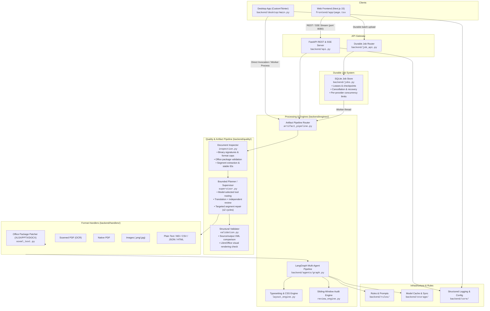
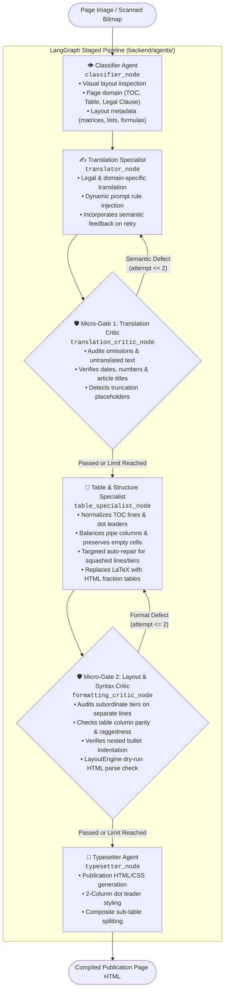

# Document Translator

A modern, automated platform to translate documents—including PowerPoint presentations (`.pptx`, `.ppt`), Excel workbooks (`.xlsx`, `.xls`), Word documents (`.docx`), PDF files (digital & scanned), images, and plain text (`.txt`, `.md`, `.csv`, `.json`, `.html`)—while preserving original layouts, typography, formatting, and structural metadata.

<div align="center">
  <h3>Powered by Gemini AI Multimodal Models and Google Translate</h3>
</div>

---

## ✨ Key Features

- **Multimodal Document Translation**: Seamlessly translates **PDF (digital & scanned OCR), Word, Excel, PowerPoint, Text, Image, Markdown, CSV, JSON, and HTML** files while preserving tables, clauses, and visual hierarchy.
- **Quality-Gated Artifact Pipeline**: Every file passes through a new `backend/quality/` pipeline that inspects, plans, translates, reviews, and structurally validates the artifact before delivery — files that fail hard invariants are withheld rather than silently delivered.
- **Staged Multi-Agent Orchestration (LangGraph)**: Employs an autonomous state machine featuring specialized vision, translation, and structural agents governed by **two independent micro-gates**:
  - **Semantic Translation Critic Gate**: Audits omissions, entity preservation, and register fidelity immediately after translation.
  - **Structural Layout Linter Gate**: Programmatically validates subordinate condition tiers, table column consistency, formula syntax, and HTML renderability before typesetting.
- **Localized Targeted Repair**: Formatting defects are resolved locally at the structure layer without re-translating, avoiding unnecessary vision API calls and preventing translation regressions.
- **Durable Job Queue**: A persistent SQLite-backed job system (`backend/jobs.py`) with worker leases, idempotent submission, cancellation, checkpoints, and per-provider concurrency limits enables reliable multi-file batch processing that survives backend restarts.
- **Native Office Package Patching (`ooxml_text.py`)**: Translates XLSX, PPTX, and DOCX by patching the raw XML packages — retaining hyperlinks, run styling, charts, formulas, shapes, comments, and shared-string relationships rather than rebuilding from scratch.
- **Gemini Model Selection**: Select from the configured model options or refresh the list using your own API key; availability depends on your provider account.
- **Whole-Document Continuity Review**: A sliding-window review engine audits cross-page sentence splits, multi-page table continuity, and consecutive article numbering.
- **Detailed Excel & PPTX Support**: Automatically translates **sheet names**, **cell comments (memos)**, table cells, and complex slide shapes.
- **Ephemeral Cloud Storage & Direct Signed Downloads**: Seamlessly supports cloud transfer outputs by saving artifacts to short-lived Google Cloud Storage buffers and providing direct signed URLs, bypassing Cloud Run's 32 MiB response limit.
- **Output Retention**: Durable job artifacts expire according to the job TTL. Configure a bucket lifecycle rule for legacy cloud transfer outputs; downloading a file does not delete it.
- **Browser Activity Log**: View translation progress and download the activity recorded in the current browser session.
- **Two Flexible Interfaces**:
  - **Desktop App**: Standalone CustomTkinter desktop application with live process isolation and executable packaging.
  - **Web Application**: Serverless Next.js 15 web application with live terminal-style Server-Sent Events (SSE) streaming deployed on Google Cloud Run.
- **Multi-Tier Model Cache**: In-memory, Google Cloud Storage, and local disk synchronization for zero-latency model availability.

---

## 🌐 Web Version

Run the web application locally using the instructions below, or deploy your own instance using [the deployment guide](deploy/README.md). Publishing this source does not certify an existing hosted instance for public document uploads.

The hosted translator uses a **bring-your-own-key** model. Enter your own Gemini API key to use Gemini; the public Cloud Run API never uses the maintainer's Gemini secret for visitor requests. Google Translate can be selected without a Gemini key. Keys stay in the current browser tab by default; persistent browser storage is an explicit opt-in. Review [Privacy and data handling](docs/PRIVACY.md) before uploading documents.

## 🔐 Security and Public Use

- Public deployments require a caller-supplied Gemini key and do not expose server logs or Cloud Console links through the API.
- Request bodies are size-limited, the backend deploy script caps the service at one instance and eight concurrent requests, and a per-instance request limiter is enabled. For distributed, internet-facing abuse protection, deploy behind an external load balancer with Cloud Armor and block direct access to the default Cloud Run URL; see [the public-release checklist](docs/PUBLIC_RELEASE_CHECKLIST.md).
- Create the dedicated bucket-scoped runtime identity before deploying: `./deploy/setup-runtime-identity.ps1 -ProjectId <project>` on Windows or `./deploy/setup-runtime-identity.sh <project>` on Linux/macOS. The deployment identity also needs `roles/iam.serviceAccountUser` on `translator-runtime`.
- See [Security policy](.github/SECURITY.md), [Contributing](.github/CONTRIBUTING.md), and [Privacy and data handling](docs/PRIVACY.md).
- This repository has no `LICENSE` yet. Repository visibility alone does not grant permission to reuse the code; choose and add the intended license before inviting reuse or contributions.

---

## 🏛️ System Architecture

### High-Level System Architecture



### 🤖 LangGraph Staged Multi-Agent Page Pipeline

Every document page (especially complex scanned pages) is processed by an autonomous stateful graph governed by **LangGraph** featuring localized micro-gates and decoupled retry loops:



#### Specialized Agent Node Roles:
1. **👁️ Page Classifier Agent (`classifier_node`)**: Inspects the rendered page image using multimodal vision to classify the structural domain (`toc`, `table_dense`, `structured_clauses`, `standard`) and extracts granular layout metadata (`is_wide_matrix`, `has_multi_tier_headers`, `has_formulas`, `has_two_column_lists`, `has_nested_lists`).
2. **✍️ Translation Specialist Agent (`translator_node`)**: Translates content with domain-specific terminology, injecting specialized layout preservation rules. If iterating after critique, it incorporates targeted semantic feedback into its revision prompt.
3. **🛡️ Micro-Gate 1: Translation Semantic Critic (`translation_critic_node`)**: Evaluates semantic completeness immediately after translation. Audits omissions, untranslated source characters, entity numbers, and flags truncation placeholders (`[continues]`, `[omitted]`).
4. **📐 Table & Structure Specialist Agent (`table_specialist_node`)**: Normalizes structural elements: splits concatenated TOC lines onto discrete rows, formats page footers, balances pipe table column counts, converts LaTeX formulas to HTML tables, and executes targeted line unflattening for squashed tiers.
5. **🛡️ Micro-Gate 2: Structural & Layout Linter Critic (`formatting_critic_node`)**: Fast deterministic linting (regex, TOC discipline, LaTeX math, pipe column counts, subordinate condition tiers) plus dry-run `LayoutEngine` HTML parse validation before typesetting.
6. **🎨 Typesetter Agent (`typesetter_node`)**: Leverages `backend/engines/layout_engine.py` to produce print-ready HTML/CSS, executing dynamic 2-column dot leaders and composite table splitting for wide matrices.

---

### 🔬 Quality-Gated Artifact Pipeline (`backend/quality/`)

All documents (not just scanned PDFs) now pass through a bounded quality pipeline before any artifact is delivered. The pipeline is described in detail in [`tools/evaluation/translation-quality-assessment.md`](tools/evaluation/translation-quality-assessment.md).

```mermaid
flowchart LR
    Input["Input Document"] --> Inspector
    Inspector["🔍 Inspector<br><code>inspection.py</code><br>Binary signatures, Office<br>package validation, segment<br>extraction, stable IDs"] --> Supervisor

    Supervisor["🧠 Bounded Supervisor<br><code>supervisor.py</code><br>Model-selected routing plan,<br>translation + source-grounded<br>independent review"] --> Translate

    Translate["✍️ Translation Specialists<br>Parallel segment translation<br>with per-ID validation &<br>glossary enforcement"] --> Review

    Review["🔎 Independent Reviewer<br>Source-grounded check:<br>entity/numeric accuracy,<br>omissions, coverage"] --> Repair

    Repair["🔧 Targeted Repair<br>Up to 2 cycles on failed<br>segment IDs only; visual fit<br>repair for PPT slides"] --> Validate

    Validate["✅ Structural Validator<br><code>validation.py</code><br>XML comparison, LibreOffice<br>rendering, pixel review"] --> Deliver

    Deliver["📦 Artifact + Quality Report<br>Status: passed / needs_review / failed"]
```



**Quality states are truthful — they are never inferred from retry count.** An exhausted gate retains its defects. Missing or failed pages produce `failed`; unsupported checks produce `needs_review` with explicit findings rather than silent omission.

---

### 🗄️ Durable Job System (`backend/jobs.py`, `backend/job_api.py`)

Durability requires persistent local storage. Cloud Run uses an ephemeral container filesystem, so jobs and artifacts can disappear when an instance is replaced, including during deployment. The Dockerfile `VOLUME` declaration does not provision persistent Cloud Run storage. A single-instance cap does not change this limitation. See the [Cloud Run filesystem contract](https://docs.cloud.google.com/run/docs/container-contract#filesystem).

The web frontend supports **multi-file batch uploads** that persist across browser reloads and backend restarts:

- **Idempotent Submission**: Repeated uploads of the same file (same SHA-256 fingerprint + options) return the existing job rather than creating a duplicate.
- **Worker Leases**: SQLite row-level leases prevent two workers from processing the same job concurrently, even on restart.
- **Checkpointing**: Completed segments are persisted mid-translation; a restarted job resumes from the last checkpoint.
- **Cancellation**: Jobs can be cancelled at any point; cancelled jobs cannot publish artifacts.
- **Per-Provider Limits**: Separate concurrency limits per AI provider prevent one model from monopolizing workers.
- **Expiry**: Artifacts and job records expire after a configurable TTL (default 24h); expired records deny all access and purge data.
- **Credential Isolation**: User-supplied API keys are held only in worker memory and are never persisted to the database. After a restart, affected jobs request credentials again and retain their checkpoints.

---

### 📑 Whole-Document Sliding-Window Review Engine

In addition to page-level micro-gates, full documents undergo cross-page review via `DocumentReviewEngine` (`backend/engines/review_engine.py`):
- **Cross-Page Sentence Boundary Continuity**: Detects and joins split sentences spanning across page margins.
- **Multi-Page Table Header Continuity**: Restores repeated headers and consistent column counts when dense tables split across pages.
- **Sequential Article Numbering**: Identifies duplicate or missing article/section numbers.
- **Sliding Window Multi-Page Context**: Processes overlapping windows of 3–5 pages with up to 2 full audit iterations.

---

## 📁 Repository Structure

```
multi-language-document-translator/
├── .github/               # Security policy and contribution guidance
├── backend/
│   ├── agents/            # LangGraph multi-agent pipeline (classifier, translator, critics, typesetter)
│   │   ├── graph.py       # LangGraph state machine definition
│   │   ├── nodes.py       # Agent node implementations
│   │   └── state.py       # Shared pipeline state dataclass
│   ├── core/              # Cloud secrets resolution, GCS persistence, logging, telemetry
│   ├── desktop/           # CustomTkinter GUI application, packaging spec, process wrapper
│   ├── engines/           # Document pipeline, review engine, layout engine, translation core
│   │   ├── artifact_pipeline.py  # Shared pipeline router (web jobs + desktop)
│   │   ├── document_pipeline.py  # Document pre-assessment & handler dispatch
│   │   ├── layout_engine.py      # HTML/CSS typesetting engine
│   │   ├── review_engine.py      # Sliding-window cross-page audit engine
│   │   ├── translator.py         # Core Gemini & Google Translate adapters
│   │   └── visual_inspector.py   # Page image visual inspection helper
│   ├── handlers/          # Format handlers
│   │   ├── ooxml_text.py  # Native Office XML package patcher (XLSX, PPTX, DOCX)
│   │   ├── pdf_native.py  # Native digital PDF translation
│   │   ├── pdf_scanned.py # Scanned PDF OCR handler
│   │   ├── pdf_digital.py # Digital PDF rendering handler
│   │   ├── image_handler.py
│   │   └── text_handler.py
│   ├── quality/           # Quality-gated artifact pipeline
│   │   ├── inspection.py  # Binary signature, format capability & segment extraction
│   │   ├── models.py      # Shared contracts: Segment, Finding, Manifest, Plan, QualityReport
│   │   ├── supervisor.py  # Bounded planner, translation specialists, repair & review loop
│   │   ├── validation.py  # Structural XML comparison and LibreOffice visual validation
│   │   ├── text_adapter.py  # Structured text format adapters (MD, CSV, JSON, HTML)
│   │   └── entities.py    # Numeric token extraction and equivalence rules
│   ├── rules/             # Prompt templates and format preservation rules
│   ├── storage/           # Model cache management and cloud synchronization
│   ├── api.py             # FastAPI REST & SSE streaming server
│   ├── job_api.py         # Durable job REST router (/jobs prefix)
│   ├── jobs.py            # SQLite-backed durable job store, leases, checkpoints
│   ├── Dockerfile         # Production container definition for Google Cloud Run
│   └── main.py            # Desktop application launch entrypoint
├── deploy/                # Cloud Run & Cloud Build deployment automation scripts
│   ├── cloudbuild.yaml             # Combined Cloud Build pipeline
│   ├── cloudbuild-backend.yaml     # Backend-only Cloud Build pipeline
│   ├── cloudbuild-frontend.yaml    # Frontend-only Cloud Build pipeline
│   ├── deploy-all.ps1 / .sh        # Full-stack deployment scripts
│   ├── deploy-backend.ps1 / .sh    # Backend-only deployment scripts
│   ├── deploy-frontend.ps1 / .sh   # Frontend-only deployment scripts
│   └── README.md                   # Cloud deployment documentation and IAM guide
├── frontend/              # Next.js 15 web application (React 19)
│   ├── app/               # Next.js application routes and UI components
│   │   └── durable-jobs.ts  # Durable job client (submission, polling, download)
│   ├── Dockerfile         # Frontend container definition
│   └── package.json       # Frontend dependencies and build scripts
├── docs/                  # Privacy and public-release guidance
├── output/                # Local offline evaluation results (ignored)
│   └── evaluation.json    # Machine-readable corpus run results
├── tools/                 # Developer, evaluation, verification, and operations utilities
│   ├── evaluation/        # Offline regression corpus and quality checks
│   │   ├── corpus.v1.json              # Versioned test fixture corpus
│   │   ├── run_evaluation.py           # Corpus runner (requires local test modules)
│   │   ├── test_*.py                   # Local-only regression suites (ignored)
│   │   └── translation-quality-assessment.md  # Quality architecture & status
│   ├── operations/        # Batch translation, sample review, and secret sync commands
│   │   ├── run-local.ps1               # Windows setup, checks, and service launcher
│   │   ├── sync_secrets.py             # Cloud secret & bucket health check utility
│   │   ├── translate_documents.py      # Batch translation CLI
│   │   └── translation-pipeline.md     # Operations guide: config, API, recovery, quality reports
│   └── verification/      # API, streaming, and durable-job integration checks
│       ├── verify_api_stream.py          # Backend SSE stream smoke test
│       ├── verify_document_stream.cjs    # Browser document stream smoke test
│       └── verify_durable_jobs_ui.cjs    # Browser durable-jobs UI smoke test
├── .gitignore             # Comprehensive hygiene rules preventing credential and cache leaks
└── requirements.txt       # Python runtime dependencies
```

---

## ☁️ Multi-PC Cloud Architecture

Local operators can authenticate using Google Cloud application-default credentials. Cloud Run uses its dedicated runtime service account for storage access. Public Gemini requests require a caller-supplied key; cloud authentication alone does not provide visitor credentials.

```
┌────────────────────────────────────────────────────────┐
│               Developer PC / Cloud Run                 │
└──────────┬───────────────────────────────┬─────────────┘
           │ Dual-mode Secret Resolution   │ State & Logs
           ▼                               ▼
┌─────────────────────────┐     ┌──────────────────────────────────┐
│ Google Cloud            │     │ Google Cloud Storage (GCS)       │
│ Secret Manager          │     │ gs://<project>-document-         │
│                         │     │        translator-data/          │
│ • gemini-api-key        │     │                                  │
│ • langsmith-api-key     │     │ • document-translator/           │
│ • oauth-tokens          │     │     models_cache.json            │
└─────────────────────────┘     │     config.json                  │
                                │     run_log.json (Audit Logs)    │
                                │     outputs/ (Ephemeral Buffers) │
                                └──────────────────────────────────┘
```

### Architectural Storage & Resolution Strategy

| Layer | Target Cloud Service | Location / Format | Multi-PC Resolution Strategy |
| :--- | :--- | :--- | :--- |
| **Operator API Keys & Secrets** | **Google Cloud Secret Manager** | `gemini-api-key`, `langsmith-api-key` | Used only by private local/desktop workflows; public Cloud Run requests must supply the visitor's key |
| **Persistent State / Models** | **Google Cloud Storage (GCS)** | `gs://<project>-document-translator-data/` (`asia-northeast1`) | Canonical source of truth; regional bucket in Tokyo; local caches strictly reside in OS temporary directory (`tempfile.gettempdir()`) |
| **User Preferences** | **Google Cloud Storage (GCS)** | `gs://<bucket>/document-translator/config.json` | Synced to GCS and OS temp cache; never written to git workspace |
| **Operational & Audit Logs** | **GCS & Cloud Logging** | `gs://<bucket>/document-translator/run_log.json` + `stdout` | Operational status metadata; not exposed through public API routes |
| **Ephemeral Transfer Outputs** | **Google Cloud Storage (GCS)** | `gs://<bucket>/document-translator/outputs/` | Short-lived transfer buffers with signed download URLs; configure and verify bucket lifecycle deletion |
| **Durable Job Artifacts** | **Local Persistent Volume** | `$TRANSLATOR_JOB_DIR/` (default: OS temp) | SQLite job store + artifact files on one host; horizontal Cloud Run scaling requires an external distributed store |
| **Preserved Evaluation Samples** | **Local Storage** | `samples/` (optional, local-only) | Sample test documents preserved locally in `samples/sample_input/` and `samples/sample_output/` (ignored in git) |

---

## ⚙️ Environment Variables & Configuration

When authenticated with Google Cloud, shared cloud state resolves automatically. The variables below are optional runtime overrides; operator credentials belong in Secret Manager and must not be used as visitor credentials by the public API:

| Variable | Default | Description |
|---|---|---|
| `GOOGLE_CLOUD_PROJECT` | Auto-detected | Target GCP project identifier (defaults to active `gcloud` configuration). |
| `GCS_BUCKET_NAME` | `<project>-document-translator-data` | Target Google Cloud Storage bucket for shared models, config, and audit logs. |
| `GEMINI_API_KEY` | Unset | Used by private local/desktop runs. Public Cloud Run requests always require the visitor's own key. |
| `ALLOW_SERVER_GEMINI_KEY` | `false` | Explicit local-only opt-in to resolve the operator's Gemini key. Ignored on Cloud Run. |
| `LANGSMITH_API_KEY` | *Secret Manager* | Overrides the `langsmith-api-key` resolved from GCP Secret Manager. |
| `OUTPUT_DIR` | OS Temp (`%TEMP%/translator_output`) | Directory for rendered files; defaults to OS temp to prevent workspace pollution. |
| `LOGS_DIR` | OS Temp (`%TEMP%/translator_logs`) | Directory for persistent log files; defaults to OS temp to prevent workspace pollution. |
| `PORT` | `8080` | Port bound by the FastAPI backend web service. |
| `NEXT_PUBLIC_API_URL` | `http://localhost:8080` | Backend API endpoint URL used by Next.js frontend. |
| `TRANSLATOR_JOB_DIR` | OS Temp (`/tmp/translator-jobs`) | Root directory for the SQLite job store and artifact files. Must be a persistent local volume for durable jobs. |
| `TRANSLATOR_JOB_TTL` | `86400` | Job artifact retention in seconds (default 24h). Expired jobs deny access and purge data. |
| `TRANSLATOR_JOB_WORKERS` | `2` | Total concurrent job worker threads. |
| `TRANSLATOR_PROVIDER_WORKERS` | `2` | Maximum concurrent workers per AI provider (prevents one model monopolizing the pool). |

---

## 🚀 Getting Started & Zero-Setup Run

Prerequisites: Python 3.11+, Node.js 20+, and npm. Install LibreOffice for Office rendering checks; cloud deployment additionally requires the Google Cloud SDK and access to the target project.

### 1. Cloud Authentication (for operator cloud features)
Authenticate once with Google Cloud SDK:
```bash
gcloud auth login
gcloud auth application-default login
```

Verify that all cloud secrets, models cache, and storage buckets are healthy:
```bash
python tools/operations/sync_secrets.py --check
```

### 2. Installation
```bash
# Clone the repository
git clone https://github.com/henryhyunwookim/multi-language-document-translator.git
cd multi-language-document-translator

# Install Python backend dependencies
pip install -r requirements.txt

# (Optional) Install Next.js frontend dependencies
cd frontend
npm ci
cd ..
```

### 3. Launching the Desktop Application
```bash
# Launch via standard launcher (API key and settings load automatically from cloud):
python backend/main.py
```

### 4. Running the Full Web App Locally (Windows)
The launcher starts the API and web UI together, monitors startup, writes service logs under `%LOCALAPPDATA%\DocumentTranslator\logs`, and cleans up both process trees on Ctrl+C:
```powershell
.\tools\operations\run-local.ps1 -Mode Setup  # First run only: install Python and frontend dependencies
.\tools\operations\run-local.ps1 -Mode Check  # Optional local dependency and renderer checks
.\tools\operations\run-local.ps1             # Start API on 8080 and web UI on 3000
```
Open `http://127.0.0.1:3000`; the API docs are at `http://127.0.0.1:8080/docs`. Use `-ApiPort` and `-WebPort` to choose other ports. Enter a Gemini API key in the UI. To opt into the operator's key for a private local-only run, set `ALLOW_SERVER_GEMINI_KEY=true`; Cloud Run ignores this setting.

The API and UI may also be run separately for development:
```bash
uvicorn backend.api:app --reload --port 8080
cd frontend && npm run dev
```

---

## 🛠️ Multi-PC Sync Utility (`tools/operations/sync_secrets.py`)

The repository includes a dedicated CLI utility for synchronizing cloud resources:

```bash
# 1. Health check using your configured cloud credentials
python tools/operations/sync_secrets.py --check

# 2. Dry-run audit
python tools/operations/sync_secrets.py --dry-run

# 3. Push or update Gemini API key in Secret Manager
python tools/operations/sync_secrets.py --push-secrets --gemini-key "<YOUR_GEMINI_API_KEY>"

# 4. Clean all local temporary and state files from workspace
python tools/operations/sync_secrets.py --clean-local
```

---

## 📦 Building Standalone Executables

To bundle the Desktop application into a single self-contained Windows executable (`.exe`) with bundled CustomTkinter assets:
```bash
python backend/desktop/build_exe.py
```
The compiled binary will be placed in `dist/DocumentTranslator.exe`.

---

## ☁️ Cloud Deployment

Automated deployment scripts for Google Cloud Run are located in [`deploy/`](deploy/):

```powershell
# Provision bucket-scoped runtime access once
.\deploy\setup-runtime-identity.ps1 -ProjectId <project>

# Windows PowerShell - Deploy entire stack
.\deploy\deploy-all.ps1 -ProjectId <project>

# Windows PowerShell - Deploy Backend API only
.\deploy\deploy-backend.ps1

# Windows PowerShell - Deploy Web Frontend only
.\deploy\deploy-frontend.ps1
```

```bash
# Bash / Linux / macOS
./deploy/deploy-all.sh
./deploy/deploy-backend.sh
./deploy/deploy-frontend.sh
```

*(For step-by-step instructions and GCP IAM prerequisite setup, refer to [deploy/README.md](deploy/README.md).)*

---

## 🧪 Testing & Verification

Frontend production validation (includes TypeScript checks; lint is separate):
```bash
cd frontend
npm ci
npm run build
npm run lint
```

### Offline Regression Corpus (no model calls)

Regression modules matching `test_*.py` are retained locally and ignored by Git under this workspace’s commit policy. The commands below require those local modules and are not a complete test suite in a fresh clone. The versioned corpus manifest and runner remain tracked.
Run the full versioned offline corpus, which writes machine-readable results to `output/evaluation.json`:
```bash
python tools/evaluation/run_evaluation.py
```

Individual test modules can be run directly:
```bash
# Quality pipeline: segment IDs, repair cycles, model budgets, Office reconstruction
python -m pytest tools/evaluation/test_quality_pipeline.py -v

# Office package preservation: Excel formulas, PPTX links/styles/breaks, Word fields
python -m pytest tools/evaluation/test_office_preservation.py -v

# Multilingual quality & edge cases: numeric equivalence, full-width digits, cache isolation
python -m pytest tools/evaluation/test_multilingual_quality.py -v

# Durable job system: leases, cancellation, recovery, per-provider limits, expiry
python -m pytest tools/evaluation/test_durable_jobs.py -v

# Job API integration: idempotency, auth, quality reports, artifact access
python -m pytest tools/evaluation/test_job_api.py -v

# PDF gates: credential isolation, gate truthfulness, cache cleanup
python -m pytest tools/evaluation/test_pdf_gates.py -v
```

### Live Integration Smoke Tests
```bash
# API streaming smoke test (requires running backend)
python tools/verification/verify_api_stream.py

# Browser document stream check
node tools/verification/verify_document_stream.cjs

# Browser durable-jobs UI check
node tools/verification/verify_durable_jobs_ui.cjs
```

> **Note**: Semantic/visual accuracy against real-world bilingual document pairs has not been established by the offline corpus. The corpus exercises structural invariants, gate truthfulness, job durability, and Office round-trips. See [`tools/evaluation/translation-quality-assessment.md`](tools/evaluation/translation-quality-assessment.md) and the [operations guide](tools/operations/translation-pipeline.md) for the full quality model and known limitations.
